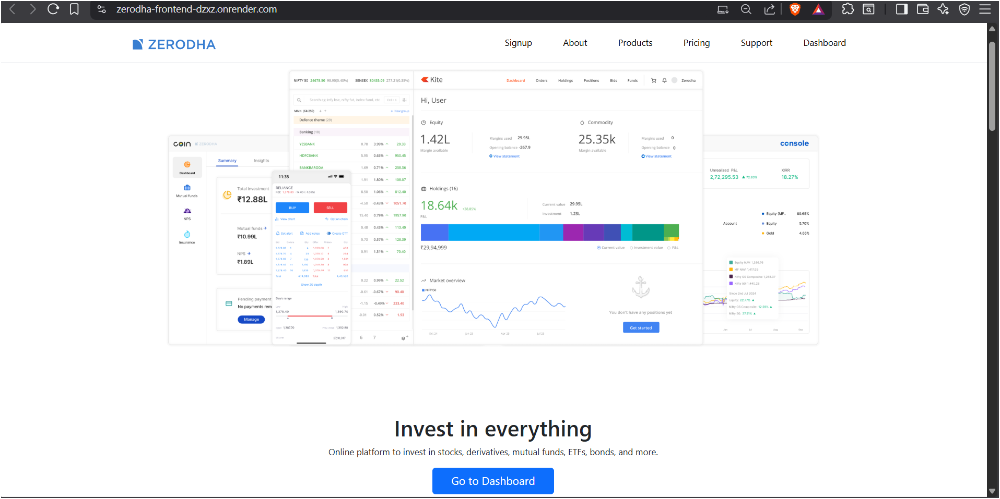
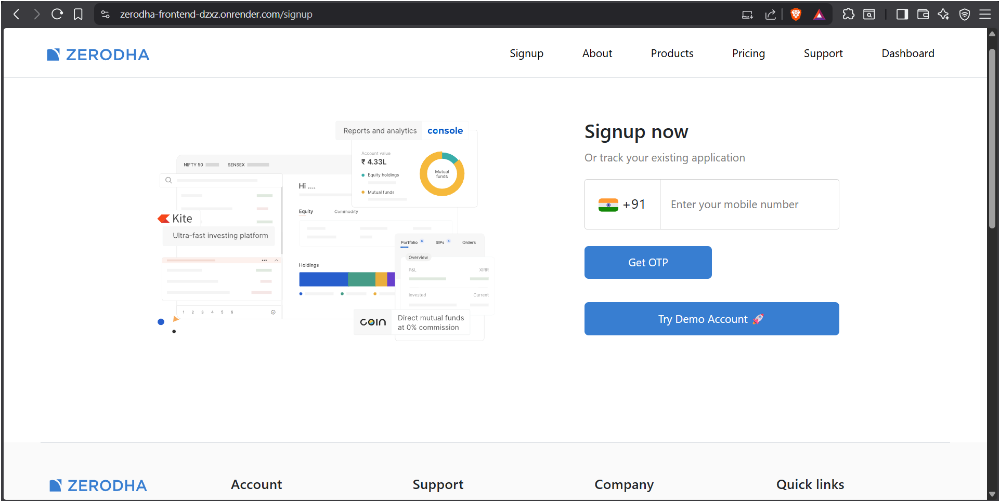
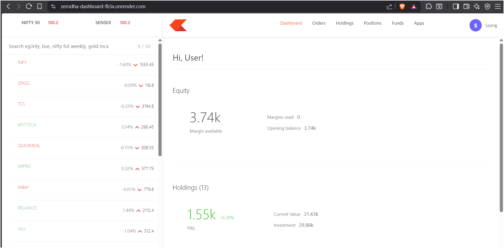
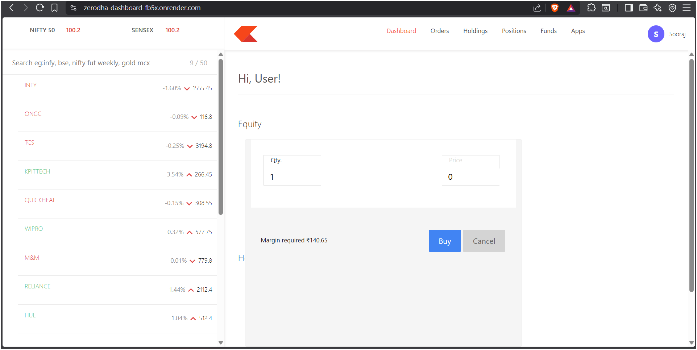
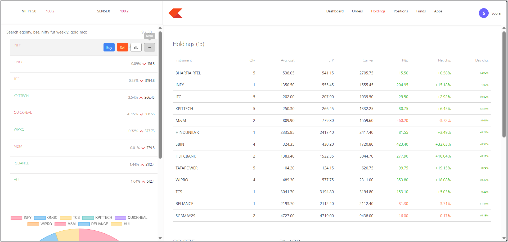
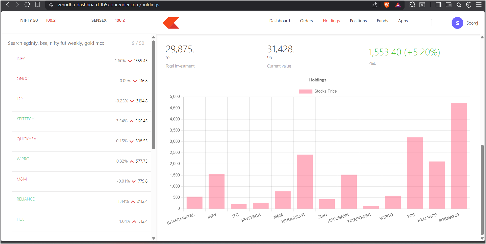

## 🚀 Zerodha-Inspired Trading Platform (Full-Stack)

A full-stack stock trading web application inspired by Zerodha, designed to simulate real-time trading workflows including authentication, portfolio management, and order execution.


---

## 🚀 Live Demo

🔗 https://zerodha-frontend-dzxz.onrender.com  

💡 Use the Demo Account feature to explore the dashboard instantly without signup.

---

## 🧠 Key Highlights

- ⚡ Built a complete trading workflow with **Buy/Sell order execution**
- 🔐 Implemented **OTP-based authentication system**
- 🚀 Added **Demo Account feature** for instant access without signup
- 📊 Developed **interactive dashboard with real-time portfolio insights**
- 📈 Integrated **data visualization (charts)** for holdings analysis
- 🧩 Designed modular architecture with separate frontend, backend, and dashboard services

---

## 🛠 Tech Stack

**Frontend:**  
- HTML, CSS, JavaScript, React  

**Backend:**  
- Node.js, Express.js  

**Database:**  
- MongoDB  

**Other:**  
- REST APIs  
- Chart.js (for data visualization)

---

## ✨ Features

- 🔐 Secure OTP-based login & authentication  
- ⚡ Demo login for quick recruiter testing  
- 📊 Portfolio dashboard with margin, P&L, holdings  
- 💰 Buy & Sell stock simulation  
- 📈 Holdings analytics with charts  
- 📋 Orders, Positions & Funds tracking  
- 🖥 Desktop-optimized UI for better trading experience  

---

## 🧠 Project Overview

A full-stack stock trading simulation platform inspired by Zerodha, designed to replicate real-world trading workflows including authentication, order execution, portfolio tracking, and analytics dashboards.

The project demonstrates scalable architecture, interactive UI, and real-time-like trading experience.

-----------------
## 📸 Screenshots
-----
### 🏠 Landing Page
<p align="center">
  
</p>

---

### 🔐 Signup & OTP Authentication
<p align="center">
  
</p>

-----


### 📊 Dashboard Overview
<p align="center">
  
</p>

---


### 💰 Buy / Sell Stocks
<p align="center">
  
</p>

---


### 📈 Holdings & Portfolio
<p align="center">
  
</p>

-----

### 📉 Analytics & Charts
<p align="center">
  
</p>

---

## ⚡ Key Engineering Decisions

- Designed **separate services architecture** (frontend, backend, dashboard) for scalability  
- Implemented **state management for trading actions** (buy/sell updates reflected instantly)  
- Optimized UI for **fast interaction and minimal latency perception**  
- Built reusable components for maintainability  

---

## 📦 Installation

```bash
git clone https://github.com/VeereshMK-07/zerodha-frontend
cd zerodha-frontend
npm install
npm start

---------

## 🎯 Impact

- 🚀 Reduced onboarding friction using **Demo Account feature (no login required)**
- ⚡ Improved user experience with fast, responsive UI interactions  
- 📊 Delivered a **real-world trading simulation experience** with portfolio insights.

----------

## 👨‍💻 Author

**Veeresh M KAKAMARI**

- 🔗 GitHub: https://github.com/VeereshMK-07  
- 💼 LinkedIn: https://www.linkedin.com/in/veeresh-kakamari-7593b02a0/
